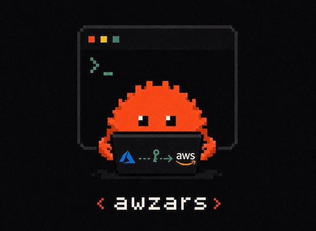

# awzars

<p align="center">
  
</p>

A Rust alternative to [aws-azure-login](https://github.com/aws-azure-login/aws-azure-login) for the same job: Azure AD / Entra ID single sign-on into AWS.

Automates Azure AD authentication and exchanges SAML assertions for AWS
temporary credentials via the AWS CLI `credential_process` protocol — as a
single ~15 MB static musl-linked binary with no Node.js, no `node_modules`,
and no GLIBC dependency. Runs unmodified on Alpine, distroless, and any
glibc host.

## Origin

awzars was built by reading the original
[aws-azure-login](https://github.com/aws-azure-login/aws-azure-login) (Node.js,
Puppeteer-based) source tree end to end with Claude Opus 4.6–4.7 (Anthropic's
coding model) and re-expressing the same SAML federation flow in idiomatic Rust.

The Azure SAML AuthnRequest construction, the role-extraction parsing, and the
overall login pipeline shape follow the original's behavior. The storage,
cryptography, browser-automation, and terminal-UI layers are written from
scratch in Rust.

awzars is a sibling project, not a fork or a drop-in swap — aws-azure-login
remains the mature, widely-deployed option.

## Why you might pick awzars

| Dimension | aws-azure-login | awzars |
|---|---|---|
| Runtime | Node.js + `node_modules` (~100 MB) | Single static binary (~15 MB, musl) |
| Browser | Puppeteer (bundles its own Chromium) | chromiumoxide (uses system Chrome) |
| TLS | OpenSSL (system) | rustls + aws-lc-rs (vendored) |
| AWS SDK | `aws-sdk` v2 (JS) | official `aws-sdk-sts` (Rust) |
| Credential storage | Plaintext file (`~/.aws/credentials`) | OS keyring (Keychain / DPAPI / Secret Service) |
| Cold-start latency | ~2 s (Node.js + V8 warm-up) | ~50 ms |
| Installation | `npm install -g` | `cp` one binary |
| Memory zeroing | Best-effort GC | `zeroize` (Drop-based) on every secret |
| Cookie persistence | n/a (or plaintext) | ChaCha20-Poly1305 with rotating keyring-backed keys |
| AI-agent fence | n/a | Opt-in per-profile password lock + `CLAUDECODE` / `AI_AGENT` consent gate |
| TUI config manager | n/a | `awzars tui` (full CRUD on `~/.awzars/config.toml` and `~/.aws/config`) |
| Headless re-auth | Manual flag plumbing | Automatic in `credential-process` via saved cookies |
| Remote Chrome | Limited | First-class (`CHROME_REMOTE_URL`, `wss://` enforced) |

## Honest tradeoffs

- **Younger codebase.** aws-azure-login has years of production miles across
  many Azure tenant configurations. awzars handles the common federation
  setups but you may hit edge cases (custom Conditional Access policies,
  unusual MFA providers, exotic SAML claim shapes) that the original has
  already absorbed. If awzars trips on your tenant, aws-azure-login is the
  pragmatic fallback.
- **No client-side XML-DSIG verification** of the SAML assertion. Integrity is
  delegated to TLS-to-Azure plus AWS STS re-verification inside
  `AssumeRoleWithSAML`. This matches aws-azure-login's behavior, but a
  client-side check would still be additional defense in depth, and a vetted
  Rust XML-DSIG implementation is not yet available.
- **System Chrome required.** awzars does not bundle Chromium (deliberately —
  bundling would defeat the static-binary value proposition). You need a
  Chrome, Chromium, or Edge install on the host, or a remote Chrome via
  `CHROME_REMOTE_URL`.
- **Linux-first session binding.** The session-scoped unlock token uses
  `getsid(0)` plus `/proc/<sid>/stat` start-time on Linux; non-Linux hosts
  fall back to SID liveness only (acceptable, but documented in
  `SECURITY_AUDIT.md` as `L-2`).
- **No Node.js plugin ecosystem.** If your workflow extends aws-azure-login
  via a Node.js wrapper, you'll need to re-shape that integration around the
  CLI surface.

## Migrating from aws-azure-login

awzars and aws-azure-login can coexist on the same machine pointing at the
same `~/.aws/config` — the two never share state, so you can flip one
profile at a time and roll back by editing the `credential_process` line.

| aws-azure-login | awzars equivalent |
|---|---|
| `aws-azure-login --configure --profile work` | `awzars configure --profile work` |
| `aws-azure-login --profile work` | `awzars login --profile work` |
| `aws-azure-login --no-prompt --profile work` | `awzars login --headless --remember-me --profile work` |
| `credential_process = aws-azure-login --no-prompt --profile work` (in `~/.aws/config`) | `credential_process = /usr/local/bin/awzars credential-process --profile work` |
| Stored credentials in `~/.aws/credentials` | Stored in OS keyring (`awzars clear-cache` to drop, `awzars delete-profile` for a full wipe) |

## AI security review

This codebase was reviewed by two LLMs as a defense-in-depth complement to the
human review:

- **Anthropic Claude Opus 4.7** — primary code author; ran a full read-through
  of credential, cookie, config, browser, SAML, lock, and AWS-config write
  paths.
- **OpenAI GPT-5.5** — independent security check (second pass alongside Opus
  4.7) via the Codex CLI.

Both checked the documented threat model — see
[`SECURITY_AUDIT.md`](SECURITY_AUDIT.md) for the full scope and current
findings:

- **No** critical, high, medium, or low exploitable issues identified.
- Two accepted residual risks (M-2: failure-counter is same-UID resettable;
  L-2: Linux-only start-time binding; L-8: `config.toml` follows symlinks
  inside the `0o700` config dir) — each documented with the threat-model
  reasoning for accepting them.

The audit covers the Rust source. Chromium runtime exploitation,
rustls/ring/aws-lc-rs primitives, and OS-keyring implementations are out of
scope and delegated to their upstreams.

LLM review complements but does not replace human review or formal audit.

## Build from source

awzars is a single Cargo workspace with no `build.rs` magic and no system
package dependencies on the static-build path. The default release target
is a static musl-linked Linux binary; native builds for macOS, Windows,
and glibc Linux work too and are convenient for development.

### 1. Get the source

```bash
git clone https://github.com/moyataka/awzars
cd awzars
```

### 2. Install the Rust toolchain

```bash
curl --proto '=https' --tlsv1.2 -sSf https://sh.rustup.rs | sh
rustup toolchain install stable      # 1.75+ recommended
```

### 3a. Static musl build (recommended for distribution)

`cargo-zigbuild` + `zig` is the lightest path — no Docker, no cross-libc
toolchain. The output is the same ~15 MB statically-linked binary that
runs on Alpine, distroless, and any glibc host without modification.

```bash
# One-time tooling install
pip install ziglang cargo-zigbuild
rustup target add x86_64-unknown-linux-musl

# Build
cargo zigbuild --release --target x86_64-unknown-linux-musl

# Test
cargo zigbuild --test '*' --target x86_64-unknown-linux-musl

# Output
ls -lh target/x86_64-unknown-linux-musl/release/awzars
file   target/x86_64-unknown-linux-musl/release/awzars   # → "statically linked"
```

For aarch64 hosts (Apple Silicon, ARM servers), substitute
`aarch64-unknown-linux-musl` everywhere above.

### 3b. Native development build

For day-to-day development on macOS, Windows, or glibc Linux, a plain
`cargo build` is fastest — it picks up your host's linker and skips the
musl toolchain entirely.

```bash
cargo build              # debug build
cargo build --release    # optimized
cargo run -- login       # build + run in one step
cargo test               # run the test suite
```

**Native build prerequisites by host:**

- **macOS** — Xcode Command Line Tools (`xcode-select --install`). No
  Homebrew packages needed; `keyring-rs` uses the `Security.framework`
  bindings shipped with the OS.
- **Windows** — MSVC build tools (the Visual Studio "Desktop C++"
  workload). `keyring-rs` uses the `wincred.h` bindings shipped with the
  Windows SDK.
- **Linux (glibc)** — `gcc` or `clang`. The vendored `libdbus` (pulled in
  for the Secret Service keyring backend) compiles from source as part
  of the cargo build, so you do **not** need `libdbus-1-dev` installed.

### 4. Verify the build

```bash
./target/release/awzars --version
./target/release/awzars --help

# For the musl build, confirm the static-linkage promise:
ldd target/x86_64-unknown-linux-musl/release/awzars
# → "not a dynamic executable"
```

### 5. Quality gates run in CI

```bash
cargo fmt --check
cargo clippy --all-targets -- -D warnings
cargo test
cargo deny check          # supply-chain bans (openssl, native-tls)
cargo audit               # advisory scanner
```

## Install

### Pre-built binary

**macOS (Apple Silicon M1/M2/M3)**

```bash
VERSION=$(curl -fsSL https://api.github.com/repos/moyataka/awzars/releases/latest \
  | grep '"tag_name"' | cut -d'"' -f4)
curl -fsSL "https://github.com/moyataka/awzars/releases/download/${VERSION}/awzars-${VERSION}-aarch64-apple-darwin.tar.gz" \
  | tar -xz
sudo install -m 0755 awzars /usr/local/bin/awzars
```

**Linux x86\_64 (static, no GLIBC dependency)**

```bash
VERSION=$(curl -fsSL https://api.github.com/repos/moyataka/awzars/releases/latest \
  | grep '"tag_name"' | cut -d'"' -f4)
curl -fsSL "https://github.com/moyataka/awzars/releases/download/${VERSION}/awzars-${VERSION}-x86_64-unknown-linux-musl.tar.gz" \
  | tar -xz
sudo install -m 0755 awzars /usr/local/bin/awzars
```

The Linux musl binary runs unmodified on Alpine, distroless, and any glibc host.

### From source

After building (see **Build from source** above):

```bash
# System-wide
sudo install -m 0755 target/x86_64-unknown-linux-musl/release/awzars /usr/local/bin/awzars

# Per-user, no sudo
install -m 0755 -D target/x86_64-unknown-linux-musl/release/awzars ~/.local/bin/awzars
```

### Verify

```bash
awzars --version
awzars --help
```

## Use

### Quickstart

```bash
awzars configure                          # 1. set tenant ID, app ID URI, role ARN
awzars login --remember-me                # 2. log in via browser, persist the session
printf '[profile work]\ncredential_process = /usr/local/bin/awzars credential-process --profile work\n' >> ~/.aws/config
aws s3 ls --profile work                  # 3. AWS CLI now refreshes credentials silently
```

### 1. Configure a profile

```bash
awzars configure
```

Prompts for Azure AD tenant ID, app ID URI, optional default role ARN, and session duration; writes `~/.awzars/config.toml` (mode `0o600`).

### 2. Login

```bash
awzars login
```

Opens a browser, performs Azure AD login (MFA supported), extracts the SAML
assertion, calls `AssumeRoleWithSAML`, and caches the resulting AWS
credentials in the OS keyring + in-memory cache.

Useful flags:

```bash
awzars login --role-arn arn:aws:iam::123456789012:role/MyRole   # skip role selector
awzars login --force-refresh                                    # bypass cache
awzars login --remember-me                                      # persist browser session
awzars login --headless --remember-me                           # silent re-auth using saved session
awzars login --output json                                      # machine-readable output
awzars login --session-remember                                 # persist AI consent for this shell (default: ask each call)
awzars login --show-secrets                                     # debug only — see warning below
```

> **`--show-secrets` warning.** Prints live access keys to stdout (shell scrollback, paste buffer, `tmux`/`screen` logs). Use only for hand-debugging — wire AWS CLI through `credential-process` for normal use.

### 3. Wire up the AWS CLI

Add to `~/.aws/config`:

```ini
[profile work]
credential_process = /usr/local/bin/awzars credential-process --profile work
region = us-east-1
```

Then use the AWS CLI normally — awzars is invoked transparently and refreshes silently using saved session cookies:

```bash
aws s3 ls --profile work
aws ec2 describe-instances --profile work
```

Requires `awzars login --remember-me` once first to establish the persistent browser session.

### TUI config manager

```bash
awzars tui
```

Full-screen terminal UI (ratatui) with two tabs:

- **awzars profiles** (`~/.awzars/config.toml`) — full CRUD
- **AWS config** (`~/.aws/config`) — full CRUD for awzars-linked profiles,
  edit-only for others (SSO / static / assume-role)

Key bindings: `↑/↓/j/k` navigate, `a` add, `e`/`Enter` edit, `d` delete,
`Tab`/`Shift+Tab` switch tabs, `Ctrl+S` save, `Ctrl+D` clear focused field,
`Esc` cancel, `q` quit.

Assume-role profiles (`source_profile` + `role_arn`) get a dedicated form
that exposes `role_session_name` alongside the source-profile autocomplete,
so the entry written into `~/.aws/config` is complete without a follow-up
hand-edit.

### Profile lock (optional, opt-in)

```bash
awzars set-password work                       # require a password for credential ops on profile "work"
awzars unlock work                             # unlock for the current shell session (default 8h TTL)
awzars unlock work --allow-ai                  # also allow AI agents in this session to use it
awzars unlock work --ttl-hours 24              # raise the TTL (soft cap 24h)
awzars unlock work --ttl-hours 72 --allow-long-ttl  # opt-in beyond 24h, hard cap 720h (30 days)
awzars lock work                               # drop the unlock token
awzars set-password work --remove              # disable the lock (still needs old password)
```

The lock fences `login`, `credential-process`, and `list-roles` behind a
session-scoped checkpoint. Designed to stop AI agents (Claude Code, Cursor,
etc.) from autonomously invoking AWS commands without an explicit human
checkpoint. See **Hardening against AI agents** below for the threat model
and limits.

### Other commands

```
awzars list-roles         # list available AWS roles (interactive role browser)
awzars clear-cache        # drop in-memory credential cache (prompts; --yes to skip)
awzars delete-profile     # drop awzars profile + keyring entries + cookies (does NOT touch ~/.aws/config)
```

### Global flags

These work on every subcommand:

| Flag | Effect |
|---|---|
| `--profile <name>` | Pick an awzars profile (default: `default`) |
| `-v` / `-vv` / `-vvv` | Tracing verbosity: `info` / `debug` / `trace` |
| `--quiet` | Warn-and-up only (suppresses `info` logs even at `-v`) |
| `--config-dir <path>` | Override `~/.awzars/`; equivalent to env `AWZARS_CONFIG_DIR` |
| `--output text\|json\|table` | Output shape for `login` and `list-roles` |

### Exit codes

For wrappers and shell scripts:

| Code | Meaning |
|---|---|
| `0` | Success, or user quit (e.g. `q` in the role selector / TUI) |
| `1` | Generic IO / serialization failure |
| `2` | Config error (missing profile, malformed `config.toml`) |
| `3` | Azure / SAML auth failure |
| `4` | Browser or network failure |
| `5` | AWS STS / keyring / cache failure |
| `6` | TUI / dialog failure |
| `7` | Profile is password-locked and not unlocked in this session |
| `8` | AI agent context detected without consent |
| `9` | Password verification failed |
| `10` | Lock operation needed a TTY but stdin isn't one |

## Remote Chrome

For CI, headless servers, or when you want Chrome on a different machine than
awzars, set `CHROME_REMOTE_URL` to a Chrome DevTools Protocol WebSocket URL.
`wss://` is required by default; `ws://` needs `--allow-insecure-remote-chrome`
and prints a warning.

```bash
# On the Chrome host
chromium --remote-debugging-port=9222 --remote-debugging-address=0.0.0.0
curl http://chrome-host:9222/json/version   # extract the webSocketDebuggerUrl

# On the awzars host
export CHROME_REMOTE_URL="wss://chrome-host:9222/devtools/browser/<id>"
awzars login --remember-me
```

After the first `--remember-me` login via remote Chrome, session cookies are
extracted and saved locally (encrypted), so subsequent
`awzars credential-process` calls run against **local** headless Chrome —
no remote instance needed for refreshes.

See `CLAUDE.md` for full SSH-port-forward variants (Chrome on macOS, awzars on
Linux, etc.).

## Configuration

`~/.awzars/config.toml` (mode `0o600`, dir `0o700`):

```toml
aws_config_path = "~/.aws/config"   # optional override for the TUI

[profiles.default.azure]
tenant_id = "00000000-0000-0000-0000-000000000000"
app_id_uri = "https://signin.aws.amazon.com/saml"

[profiles.work]
role_arn = "arn:aws:iam::123456789012:role/MyRole"
session_duration = 3600
[profiles.work.azure]
tenant_id = "11111111-1111-1111-1111-111111111111"
app_id_uri = "https://signin.aws.amazon.com/saml"
```

Override the config dir entirely with `--config-dir <path>` or
`AWZARS_CONFIG_DIR=<path>`.

## Troubleshooting

**`--headless` fails with "no persistent browser session found".**
Headless mode reuses cookies from a prior interactive `--remember-me`
login or from a remote Chrome session. Run `awzars login --remember-me`
once interactively first, then headless re-auth works for the lifetime
of the cookies.

**SingletonLock / "another Chrome is using this profile".** If a Chrome
instance is already holding the persistent user-data-dir, awzars falls
back to a temp directory and injects the saved cookie store
(`cookies.enc`) into it. If that fallback also fails, quit the other
Chrome (or run it under a different `--user-data-dir`) and retry.

**`CHROME_REMOTE_URL` connection refused with `ws://`.** `wss://` is
required by default. Either provision a TLS-terminating proxy in front of
Chrome's debugging port, or pass `--allow-insecure-remote-chrome` and
accept the printed warning that credentials traverse an unencrypted
WebSocket.

**`credential-process` errors out with "No persistent browser session
found for profile".** Same root cause as the first item — run
`awzars login --remember-me` once before wiring the AWS CLI integration,
so a persistent session exists for silent refreshes.

## Security

- **No SAML on disk.** Assertions live in `Zeroizing<String>` and are dropped
  before any persistence.
- **OS keyring at rest.** AWS credentials and the cookie encryption key are
  stored in Keychain (macOS), Credential Manager (Windows), or Secret Service
  (Linux) via `keyring-rs`.
- **Memory zeroing.** Every sensitive type implements `Zeroize` and is wiped
  on drop. A panic hook restores raw mode / alternate screen / cursor /
  mouse capture and wipes the cookie-key cache before the default handler
  runs — necessary because release builds use `panic = "abort"`, which
  skips Drop impls.
- **Pinned password-hash parameters.** The optional profile lock uses
  Argon2id with `m = 64 MiB`, `t = 3`, `p = 4` (well above the crate's
  defaults). A regression test pins the PHC string prefix so a silent
  downgrade fails CI.
- **Lock failure backoff.** Wrong-password attempts hit an on-disk
  per-(session, profile) counter and sleep `2 / 4 / 8 / 16 / 32 / 60 / 60 s`
  capped. Counters age out after an hour of quiet so a typo last week
  doesn't penalize today's first attempt.
- **Unlock-token PID-reuse defense.** Tokens are bound to the session
  leader's `/proc/<sid>/stat` start time on Linux. After a logout +
  re-login that recycles the SID, the stored start time mismatches and the
  stale token is unlinked rather than silently honored.
- **TLS 1.2+ via rustls.** No OpenSSL anywhere on the credential path.
- **Atomic writes with `O_EXCL | O_NOFOLLOW`.** Every persisted secret
  (`config.toml`, `cookies.enc`, unlock tokens, `~/.aws/config`) goes through
  `util::atomic_write`, which defeats same-UID symlink-planting.
- **Size caps on parsed input.** SAML assertions are rejected before decode
  past 256 KB, `config.toml` reads cap at 1 MiB, and the unlock-token GC
  reads each candidate file with an 8 KiB limit so a planted
  multi-gigabyte file in the session dir cannot OOM the GC pass.
- **Cookie key rotation.** ChaCha20-Poly1305 keys rotate every 30 days, old
  keys garbage-collected after 90 days. The keystore is one keyring item per
  profile, so macOS Keychain ACL is granted once and rotation never
  re-prompts.
- **CI runs `cargo fmt --check`, `clippy -D warnings`, tests, `cargo deny check`,
  and `cargo audit`** on every PR.

Full threat model and accepted residual risks are in
[`SECURITY_AUDIT.md`](SECURITY_AUDIT.md).

### Hardening against AI agents in the same shell

awzars's built-in AI-consent gate refuses credential operations when
`CLAUDECODE` or `AI_AGENT` is set in the environment. This stops *casual*
leakage (you forgot you'd unlocked, then opened Claude Code in the same
shell). It does **not** stop an adversarial AI that runs `unset CLAUDECODE`
before invoking `awzars`.

The load-bearing layer for the adversarial case is the AI tool's own
permission system. For Claude Code, drop one of these into
`~/.claude/settings.json`:

```json
{
  "permissions": {
    "deny": ["Bash(awzars credential-process *)"]
  }
}
```

Or require explicit human approval on every call:

```json
{
  "permissions": {
    "ask": ["Bash(awzars credential-process *)"]
  }
}
```

## Requirements

- Chrome, Chromium, or Edge (local) — or a remote Chrome via `CHROME_REMOTE_URL`
- Azure AD / Entra ID with AWS federation configured
- AWS IAM Identity Provider for the Azure AD app

## License

MIT OR Apache-2.0

## Acknowledgements

- [aws-azure-login](https://github.com/aws-azure-login/aws-azure-login) — the
  Node.js project that pioneered this flow and informed the Rust
  implementation. Thanks to its maintainers for years of edge-case handling
  that this project benefits from indirectly.
- [chromiumoxide](https://github.com/mattsse/chromiumoxide), [rustls](https://github.com/rustls/rustls), [ratatui](https://github.com/ratatui-org/ratatui), [keyring-rs](https://github.com/hwchen/keyring-rs) — load-bearing dependencies.
